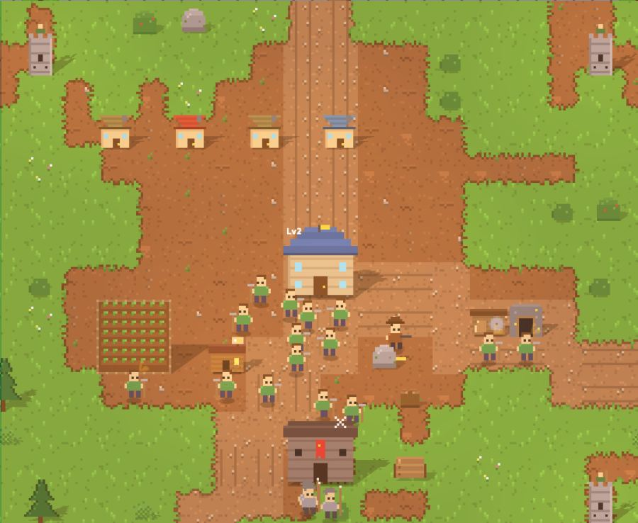
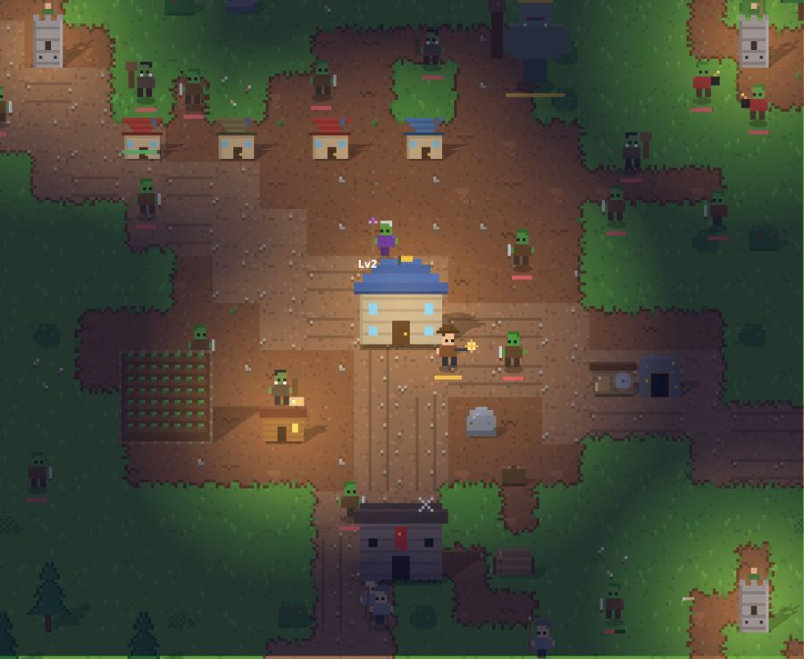

# Hollowmere 🏘️

A small, fully offline, single-player pixel-art browser game: build a town by day, defend it by night.
Think *Clash of Clans* base-building and raids crossed with a pinch of *The Sims* — your villagers
have needs, moods, jobs, and homes, and they get on with their lives while you plan the defences.
You play the Mayor: walk the forest with WASD, the camera follows, and you shoot with the mouse.

All the art is generated in code — every sprite is drawn at 16 px and scaled up with crisp pixels,
so there are no image files and nothing to download.

No build step, no dependencies, no internet needed. Open `index.html` and play.



*Day: lay out the town.*



*Night: goblins, orcs, a shaman and bombers come out of the forest.*

## Play

```bash
# any static server works, or just double-click index.html
python3 -m http.server 8765
```

Then open <http://localhost:8765>. Progress autosaves in your browser. When served over HTTP (for example
from GitHub Pages) a service worker caches the game, so it keeps working with no connection and can be
installed to the home screen.

## How it works

The map is a 64×48 tile forest with dirt roads running out of town to the map edge,
boulders, log piles and bushes scattered through the trees, and a day/night cycle with
golden-hour light and torches burning after dark. Some days bring **rain**, which waters the
farms for a third more food, or **fog**, which closes in and hides the forest.

**Day (90 s)** — place buildings, chop trees for wood, keep villagers happy.

| Building | Cost | Does |
| --- | --- | --- |
| 🏠 House | 20 wood | Houses 3 villagers |
| 🌾 Farm | 30 wood | Worker grows food |
| 🪵 Lumber Mill | 25 wood, 10 gold | Worker chops wood |
| ⛏️ Gold Mine | 40 wood | Worker digs gold |
| 🧱 Wall | 8 wood | Tough. Mobs must chew through it |
| 🚪 Gate | 15 wood, 10 gold | A wall your own people walk through |
| 🏹 Archer Tower | 30 wood, 30 gold | Shoots mobs within 5 tiles |
| ⚔️ Barracks | 60 wood, 60 gold | Trains 3 soldiers (Town Hall lv2) |
| 🍺 Tavern | 30 wood, 40 gold | Villagers have fun here (Town Hall lv2) |

A quest list in the side panel hands out rewards for milestones — first house, first night survived,
25 kills, the Troll King, and so on. On touch screens an on-screen joystick and dash/war-cry buttons appear.

Walls stop villagers, soldiers and the Mayor as well as raiders, so leave a **Gate**: your
own people walk through it, raiders have to break it down. Raiders try to walk around
walls, but once they stop making progress for a few seconds they commit and smash
straight through, so a sealed ring buys time rather than safety.

Villagers with no job walk over and **repair** battle damage for free, so a big, happy
population is what keeps the town standing between raids.

Villagers arrive on their own while you have spare housing. Each one picks the nearest unstaffed
farm, mill or mine and works it. They have three needs — **food, energy, fun** — and their happiness
sets how fast they work (50 % to 100 %). They eat from the town food stock, sleep in houses at night,
and visit the tavern when bored.

**Night (50 s)** — goblins, orcs and trolls come out of the forest at the map edges and attack the nearest
building. Walls in their path get smashed first. Towers shoot, soldiers hunt, and you control the
**Mayor 🤠**: walk with `WASD`, hold the left mouse button to shoot, and press `Q` for a War Cry that
blasts every mob nearby. Every 10 kills the Mayor levels up, and gold buys rifle, vest and boots upgrades.
Shamans lob fire from range, bombers sprint at your walls and explode, and every fifth night the Troll King
leads the raid. Kills sometimes drop wood, food, gold or hearts for the Mayor to pick up. Waves grow every night; clear one completely for a gold bounty, and watch the
town log for random daily events — merchants, festivals, rats in the wood store.

Upgrade the Town Hall to unlock the Barracks and Tavern, gain housing, and (at level 3) boost
tower damage. **If the Town Hall falls, the town is lost.**

### Controls

| Key | Action |
| --- | --- |
| `WASD` / arrows | Walk the Mayor (camera follows) |
| Left-click | Shoot — or place the selected building (drag to paint walls) |
| Right-click | Inspect a building, villager or mob; cancels build mode |
| `1`–`9` | Pick a building (Shift-click to place several) |
| `Esc` / right-click | Cancel |
| `X` | Demolish mode (50 % refund; chops trees for 6 wood) |
| `R` | Repair everything (1 wood per 10 HP) |
| `Q` | Mayor's War Cry (20 s cooldown) |
| `Shift` | Dash while walking (3 s cooldown) |
| `M` | Mute |
| `Space` | Pause |

## Code

Three files, zero dependencies:

- `index.html` — layout and menus
- `style.css` — the look
- `sw.js` / `manifest.json` — offline cache and install metadata
- `game.js` — data tables (`DEFS`, `MOBS`, `TH_LEVELS`), pixel sprite generator (`buildSprites`), simulation, camera renderer, DOM UI and save/load

Tuning knobs live at the top of `game.js`: world size, zoom, day/night length, building stats, mob stats and the
`waveFor()` function that decides what each night throws at you. To swap in real artwork, replace the
canvases in `SPR` with loaded images of the same sizes (16×16 per tile, 32×32 for 2×2 buildings).

## License

MIT
